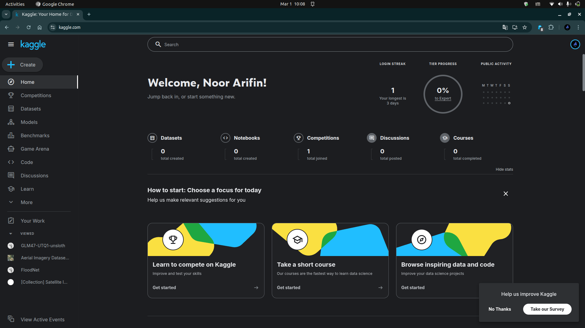
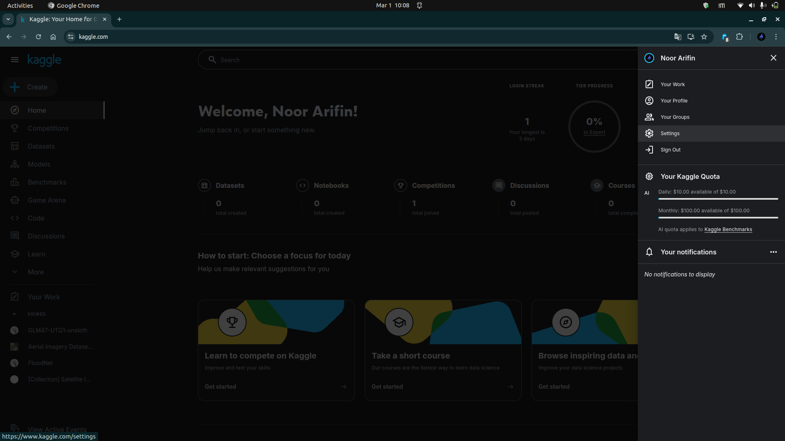
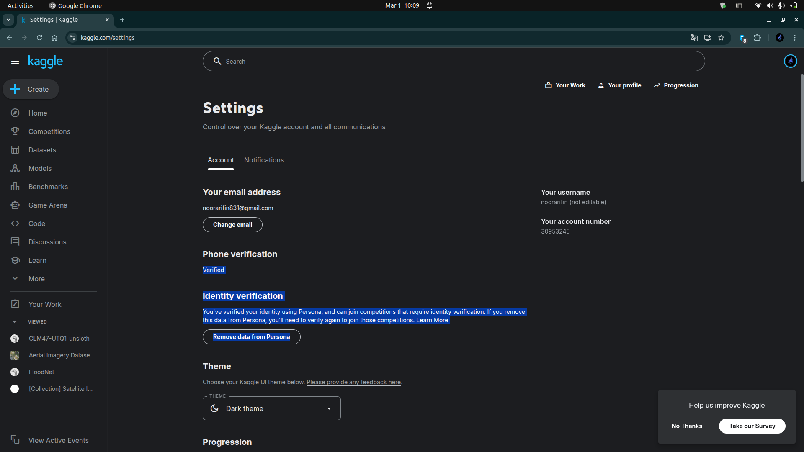

# Bab 2 — Persiapan Sebelum Membuat Kompetisi

## Membuat Akun Kaggle

Langkah pertama adalah memiliki akun Kaggle:

1. Kunjungi website [www.kaggle.com](https://www.kaggle.com)
   
   
   *Gambar 1: Halaman utama Kaggle*

2. Klik tombol "Register" di pojok kanan atas
3. Anda bisa mendaftar menggunakan:
   - Email dan password
   - Akun Google
   - Akun Facebook
4. Verifikasi email Anda

5. Lengkapi profil Anda (nama, bio, foto profil)

6. **Verifikasi Akun (Penting!)**
   
   Untuk membuat kompetisi, akun Anda harus terverifikasi:
   - Verifikasi nomor telepon
   - Verifikasi identitas (biometrik/wajah)
   
   
   *Gambar 2: Halaman Settings untuk verifikasi akun*
   
   
   *Gambar 3: Status verifikasi akun di halaman Settings*

**Tips**: Gunakan nama profesional karena profil Kaggle sering dilihat oleh recruiter.

## Menyiapkan Dataset

Dataset adalah inti dari kompetisi. Berikut hal-hal yang perlu diperhatikan:

### Kriteria Dataset yang Baik

| Kriteria | Penjelasan |
|----------|-----------|
| **Relevan** | Dataset harus sesuai dengan tujuan kompetisi |
| **Berkualitas** | Minimal cleaning sudah dilakukan, tidak terlalu banyak missing value |
| **Ukuran Memadai** | Cukup besar untuk training, tapi tidak terlalu besar (< 5GB untuk pemula) |
| **Legal** | Pastikan Anda memiliki hak untuk membagikan data tersebut |
| **Menarik** | Pilih topik yang relevan dengan situasi nyata atau trending |

### Format Dataset

Dataset biasanya dibagi menjadi:
- **train.csv**: Data untuk training model (dengan label/target)
- **test.csv**: Data untuk evaluasi model (tanpa label)
- **sample_submission.csv**: Contoh format submission yang benar

## Menentukan Tujuan Kompetisi

Sebelum membuat kompetisi, tentukan dengan jelas:

1. **Problem Statement**: Apa masalah yang ingin diselesaikan?
   - Contoh: "Memprediksi harga rumah berdasarkan fitur-fiturnya"

2. **Target Audience**: Siapa peserta yang ditargetkan?
   - Pemula, intermediate, atau advanced?
   - Mahasiswa, profesional, atau umum?

3. **Learning Objectives**: Apa yang diharapkan dipelajari peserta?
   - Feature engineering?
   - Model selection?
   - Hyperparameter tuning?

4. **Outcome**: Apa yang diharapkan dari hasil kompetisi?
   - Model terbaik?
   - Insight dari data?
   - Learning experience?

## Menentukan Jenis Problem

Pilih jenis problem yang sesuai dengan dataset Anda:

### Tipe-tipe Problem Machine Learning

| Jenis Problem | Penjelasan | Contoh |
|---------------|-----------|--------|
| **Classification** | Memprediksi kategori/kelas | Spam detection, image recognition |
| **Regression** | Memprediksi nilai numerik kontinu | Prediksi harga, temperature forecasting |
| **Clustering** | Mengelompokkan data tanpa label | Customer segmentation |
| **Time Series** | Prediksi berdasarkan data temporal | Sales forecasting, stock prediction |
| **Computer Vision** | Analisis gambar/video | Object detection, face recognition |
| **NLP** | Pemrosesan bahasa natural | Sentiment analysis, text classification |

**Untuk pemula**, disarankan mulai dengan Classification atau Regression karena lebih straightforward.

---

*Modul 1 — Cara Membuat Event Kompetisi Data di Kaggle*
