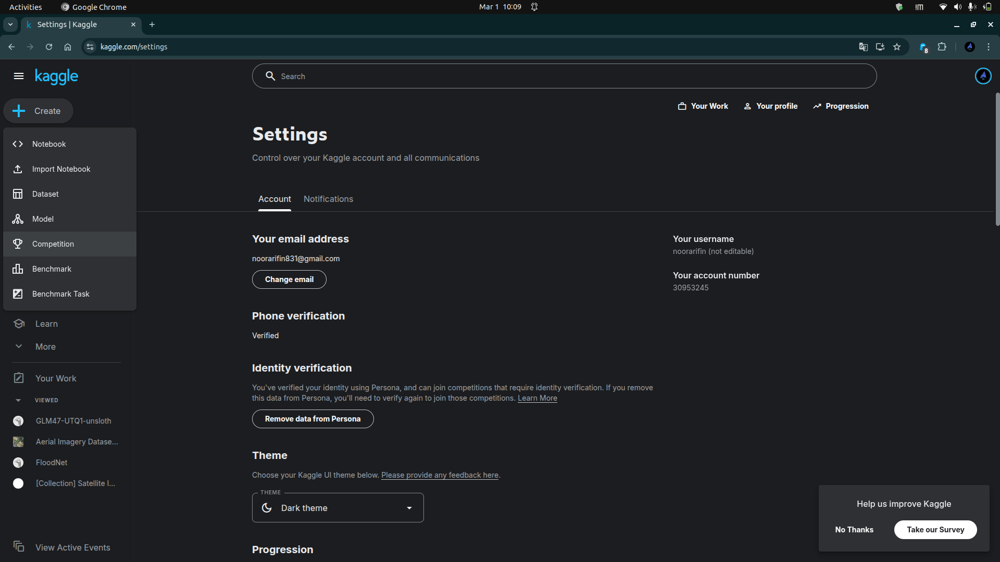
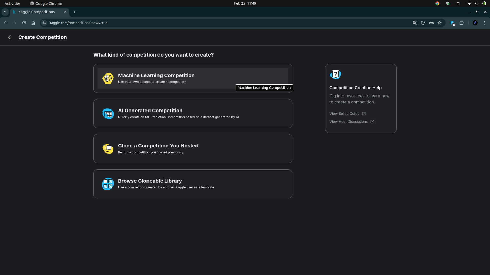
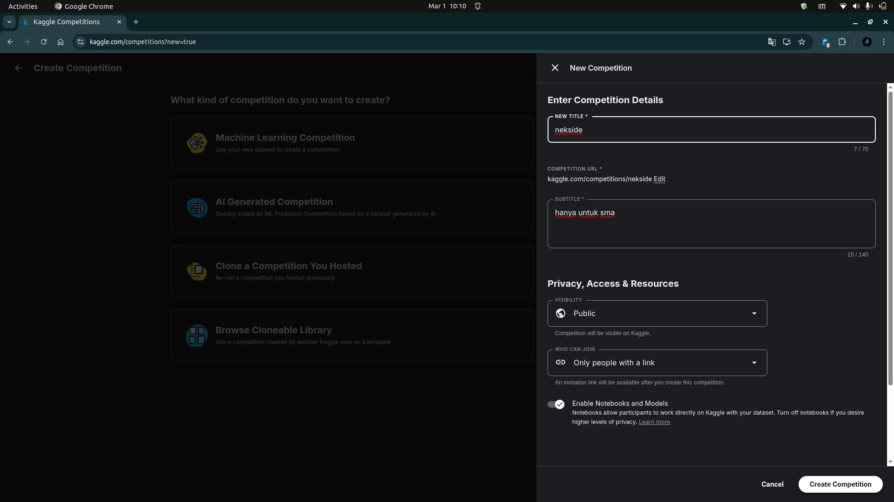
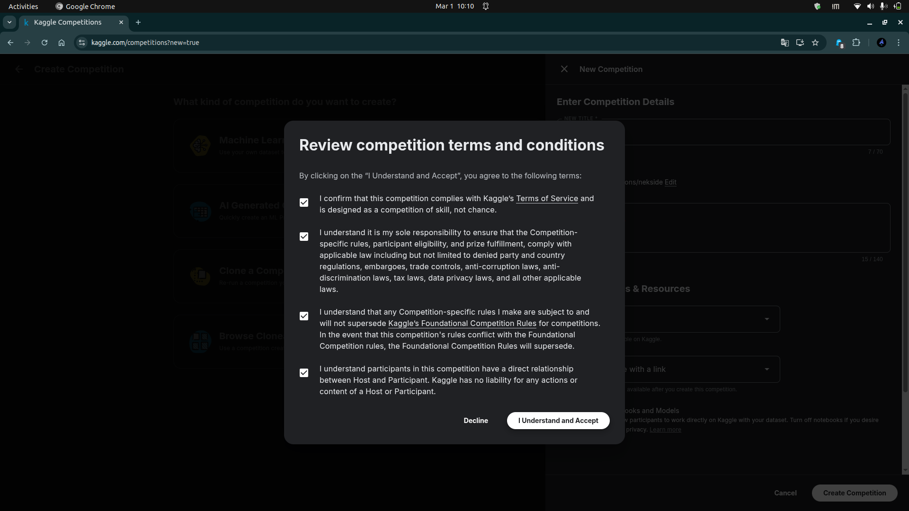
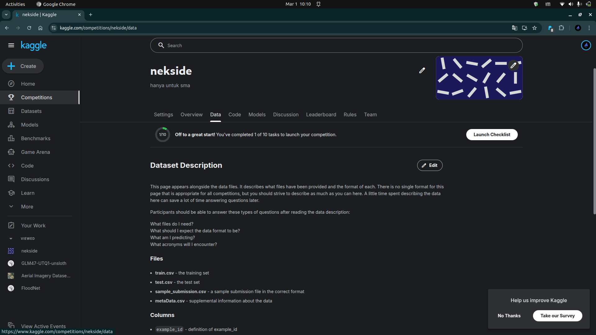
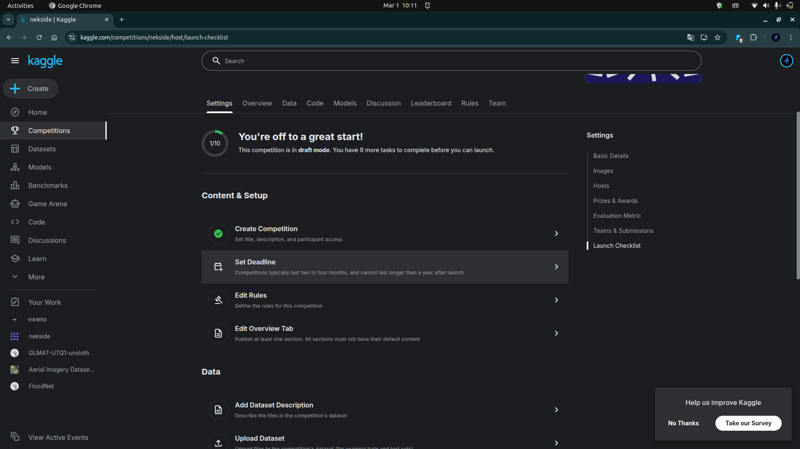
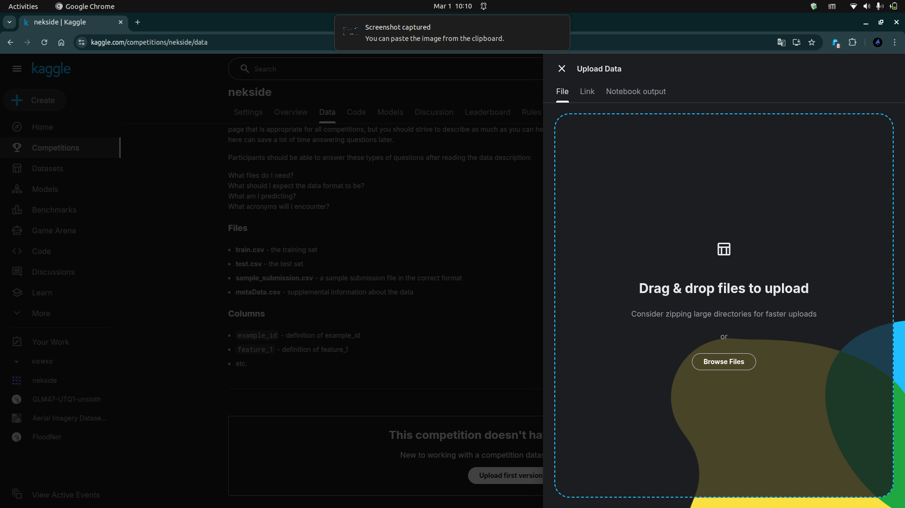
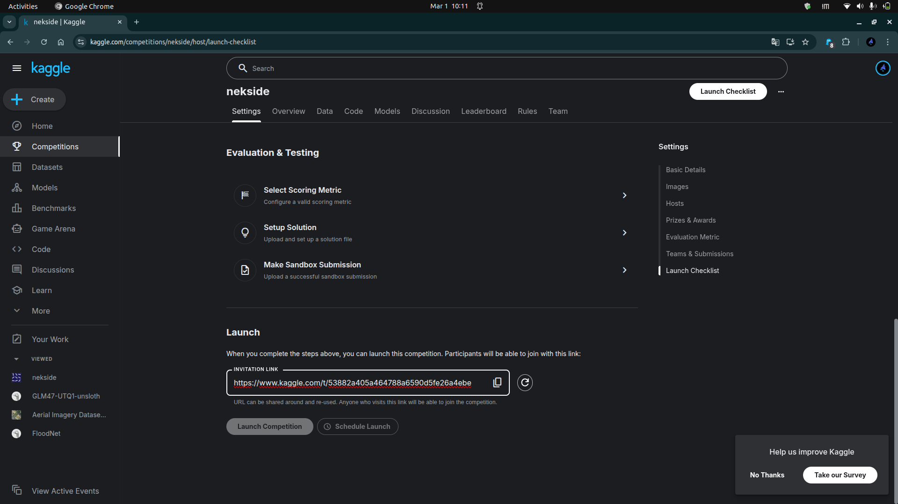

# Bab 3 — Langkah-langkah Membuat Kompetisi di Kaggle

Berikut adalah panduan lengkap step-by-step untuk membuat kompetisi di Kaggle, dilengkapi dengan screenshot di setiap langkah.

---

## Langkah 1: Masuk ke Kaggle

1. Buka [www.kaggle.com](https://www.kaggle.com)
2. Login dengan akun Anda
3. Pastikan profil Anda sudah terverifikasi (verified account)


*Gambar 1: Halaman utama Kaggle setelah login*

**Catatan Penting**: Untuk membuat kompetisi, akun Anda harus sudah terverifikasi. Lihat Bab 2 untuk panduan verifikasi akun.

---

## Langkah 2: Akses Menu Settings (Opsional)

Sebelum membuat kompetisi, pastikan akun Anda sudah siap:


*Gambar 2: Akses halaman Settings dari menu profil*

---

## Langkah 3: Verifikasi Akun Anda

Pastikan status verifikasi lengkap di halaman Settings:


*Gambar 3: Status verifikasi akun - Phone verification dan Identity verification harus "Verified"*

**Checklist Verifikasi**:
- ✅ Phone verification: Verified
- ✅ Identity verification: Verified

---

## Langkah 4: Pilih Menu Competition

1. Klik menu "Competitions" di sidebar kiri
2. Atau kunjungi [https://www.kaggle.com/competitions](https://www.kaggle.com/competitions)


*Gambar 4: Menu Competitions di sidebar Kaggle*

---

## Langkah 5: Mulai Membuat Competition

1. Klik tombol "Create" atau "New Competition"
2. Pilih jenis kompetisi yang ingin dibuat


*Gambar 5: Pilihan jenis kompetisi yang tersedia*

### Jenis Kompetisi yang Tersedia:

| Jenis | Deskripsi | Kapan Digunakan |
|-------|-----------|-----------------|
| **Machine Learning Competition** | Kompetisi menggunakan dataset Anda sendiri | Untuk kompetisi akademis, research, atau internal |
| **AI Generated Competition** | Kompetisi dengan dataset yang di-generate oleh AI | Untuk testing atau pembelajaran cepat |
| **Clone a Competition You Hosted** | Duplikasi kompetisi yang pernah Anda buat | Untuk re-run kompetisi |
| **Browse Cloneable Library** | Gunakan template kompetisi yang sudah ada | Untuk pemula yang ingin belajar |

**Untuk tutorial ini**, kita akan pilih **"Machine Learning Competition"**.

---

## Langkah 6: Isi Detail Kompetisi

Setelah memilih jenis kompetisi, Anda akan diminta mengisi detail:


*Gambar 6: Form untuk mengisi detail kompetisi*

### A. Informasi Dasar yang Harus Diisi:

### A. Informasi Dasar yang Harus Diisi:

**1. Competition Title (NEW TITLE)**:
```
Contoh: "House Price Prediction Challenge 2026"
```
- Buat nama yang catchy dan deskriptif
- Maksimal 70 karakter
- Hindari nama yang terlalu umum

**2. Competition URL**:
```
Contoh: kaggle.com/competitions/house-price-2026
```
- Akan otomatis di-generate dari title
- Bisa di-edit untuk URL yang lebih pendek

**3. Subtitle**:
```
Contoh: "Predict house prices using advanced regression techniques"
```
- Deskripsi singkat (15-140 karakter)
- Jelaskan inti dari kompetisi

**4. Privacy, Access & Resources**:

| Setting | Pilihan | Rekomendasi |
|---------|---------|-------------|
| **Visibility** | Public / Private | Public untuk umum, Private untuk internal/kelas |
| **Who Can Join** | Anyone / Only people with a link | Pilih "Only people with a link" untuk kompetisi kelas |
| **Enable Notebooks and Models** | ✅ / ❌ | ✅ Aktifkan agar peserta bisa berbagi notebook |

**Tips Penting**:
- Untuk kompetisi pembelajaran/akademis, pilih "Only people with a link"
- Aktifkan "Enable Notebooks and Models" agar peserta bisa belajar dari notebook orang lain

---

## Langkah 7: Review dan Accept Terms & Conditions

Sebelum membuat kompetisi, Anda harus menyetujui syarat dan ketentuan:


*Gambar 7: Dialog review terms and conditions*

**Checklist yang harus disetujui**:
- ✅ Kompetisi sesuai dengan Terms of Service Kaggle
- ✅ Adalah kompetisi skill, bukan chance
- ✅ Memastikan rules kompetisi comply dengan hukum yang berlaku
- ✅ Rules tidak melanggar Kaggle's Foundational Competition Rules
- ✅ Memahami hubungan antara Host dan Participant

Setelah checklist selesai, klik **"I Understand and Accept"**.

---

## Langkah 8: Akses Launch Checklist

Setelah kompetisi dibuat, Anda akan masuk ke mode **draft**. Klik "Launch Checklist" untuk melihat tasks yang harus diselesaikan:


*Gambar 8: Tombol Launch Checklist untuk melihat task yang harus diselesaikan*

**Status Kompetisi**: "This competition is in **draft mode**. You have 9 more tasks to complete before you can launch."

---

## Langkah 9: Selesaikan Semua Tasks di Launch Checklist

Anda akan melihat daftar tasks yang harus diselesaikan:


*Gambar 9: Launch Checklist menunjukkan progress 1/10 tasks completed*

### Task yang Harus Diselesaikan:

#### **Content & Setup**
1. ✅ **Create Competition** - Set title, description, and participant access
2. ⬜ **Set Deadline** - Competitions typically last two to four months
3. ⬜ **Edit Rules** - Define the rules for this competition  
4. ⬜ **Edit Overview Tab** - Publish at least one section. All sections must not have their default content

#### **Data**
5. ⬜ **Add Dataset Description** - Describe the files in the competition's dataset
6. ⬜ **Upload Dataset** - Upload files to the competition's dataset (format: train.csv, test.csv, sample_submission.csv)

#### **Evaluation & Testing**
7. ⬜ **Select Scoring Metric** - Configure a valid scoring metric
8. ⬜ **Setup Solution** - Upload and set up a solution file
9. ⬜ **Make Sandbox Submission** - Upload a successful sandbox submission

#### **Launch**
10. ⬜ **Launch Competition** - Complete all above steps

Mari kita bahas beberapa task penting:

---

## Langkah 10: Upload Dataset

Klik "Upload Dataset" dari checklist:


*Gambar 10: Dialog untuk upload dataset - bisa drag & drop atau browse files*

### Format Dataset yang Diperlukan:

### Format Dataset yang Diperlukan:

1. Siapkan file dalam format yang tepat:
   ```
   competition-dataset/
   ├── train.csv          # Data training dengan label
   ├── test.csv           # Data testing tanpa label  
   └── sample_submission.csv  # Format submission yang benar
   ```

2. **train.csv**: 
   - Berisi data training lengkap dengan kolom target/label
   - Contoh: untuk prediksi harga rumah, include kolom 'price'

3. **test.csv**:
   - Berisi data testing TANPA kolom target
   - Peserta akan memprediksi kolom ini

4. **sample_submission.csv**:
   - Format: `id,prediction`
   - Contoh:
     ```csv
     id,price
     1,150000
     2,230000
     3,180000
     ```

5. **Cara Upload**:
   - Drag & drop files ke area upload, atau
   - Klik "Browse Files" untuk pilih dari komputer
   - Bisa upload file ZIP yang berisi semua files
   - Maksimal ukuran: tergantung quota Anda

6. Tulis **Dataset Description**:
   - Jelaskan setiap file dengan detail
   - Jelaskan setiap kolom dalam dataset
   - Berikan context tentang data

---

## Langkah 11: Setup Evaluation Metric dan Rules

### A. Select Scoring Metric

Pilih metrik evaluasi yang sesuai dengan problem Anda:

### A. Select Scoring Metric

Pilih metrik evaluasi yang sesuai dengan problem Anda:

#### Metrik untuk Regression

| Metrik | Formula | Kapan Digunakan |
|--------|---------|-----------------|
| **RMSE** | $\sqrt{\frac{1}{n}\sum(y_i - \hat{y}_i)^2}$ | Default untuk regression, sensitif terhadap outlier |
| **MAE** | $\frac{1}{n}\sum\|y_i - \hat{y}_i\|$ | Lebih robust terhadap outlier |
| **R² Score** | $1 - \frac{SS_{res}}{SS_{tot}}$ | Untuk menilai proporsi variance explained |
| **RMSLE** | $\sqrt{\frac{1}{n}\sum(\log(y_i+1) - \log(\hat{y}_i+1))^2}$ | Ketika rentang nilai target sangat lebar |

#### Metrik untuk Classification

| Metrik | Kapan Digunakan |
|--------|-----------------|
| **Accuracy** | Dataset balanced, semua kelas sama penting |
| **F1-Score** | Dataset imbalanced, pentingkan precision & recall |
| **AUC-ROC** | Pentingkan kemampuan ranking, binary classification |
| **Log Loss** | Pentingkan probabilitas prediksi, bukan hanya kelas |
| **Cohen's Kappa** | Multi-class classification dengan imbalanced data |

**Contoh Pilihan**:
- Untuk prediksi harga rumah → gunakan **RMSE** atau **MAE**
- Untuk klasifikasi spam → gunakan **F1-Score** atau **AUC-ROC**
- Untuk multi-class classification → gunakan **Log Loss** atau **Accuracy**

### B. Edit Rules (Aturan Kompetisi)

Tentukan aturan yang jelas untuk kompetisi Anda:

**Pertanyaan yang harus dijawab dalam Rules**:
1. **Eligibility**: Siapa yang boleh ikut?
2. **Team Size**: Boleh individual atau team? Maksimal berapa orang?
3. **Submission Limits**: Berapa kali bisa submit per hari?
4. **Code Sharing**: Boleh berbagi kode atau tidak?
5. **External Data**: Boleh menggunakan data eksternal atau tidak?
6. **Hardware**: Batasan penggunaan GPU/TPU?
7. **Winner Selection**: Bagaimana cara menentukan pemenang?

**Contoh Rules Sederhana**:
```markdown
## Competition Rules

### Eligibility
- Terbuka untuk semua (atau: Khusus mahasiswa kelas X)

### Team Formation
- Maksimal 5 orang per team
- Team dapat dibentuk dan diubah sampai 1 minggu sebelum deadline

### Submission Limits
- Maksimal 5 submissions per hari
- Maksimal 2 submissions yang bisa dipilih untuk final leaderboard

### External Data
- Tidak diperbolehkan menggunakan external data
- Hanya boleh menggunakan data yang disediakan

### Code Sharing
- Boleh berbagi kode setelah kompetisi selesai
- Tidak boleh berbagi prediksi secara langsung

### Winner Selection
- Pemenang ditentukan dari private leaderboard
- Top 3 harus submit code untuk verification
- Code harus reproducible
```

---

## Langkah 12: Set Deadline (Timeline)

Buat timeline yang realistis untuk kompetisi Anda:

### Rekomendasi Durasi:

| Jenis Kompetisi | Durasi Rekomendasi | Alasan |
|-----------------|-------------------|--------|
| **Kompetisi Pembelajaran (Kelas)** | 4-6 minggu | Mahasiswa perlu waktu untuk belajar & experimen |
| **Playground Competition** | 2-3 bulan | Community perlu waktu untuk explore |
| **Research Competition** | 3-6 bulan | Problem kompleks butuh waktu lebih |
| **In-Class Competition** | 2-4 minggu | Sesuai semester/term |

### Timeline Phases:

| Fase | Waktu | Aktivitas |
|------|-------|-----------|
| **Start** | Day 1 | Competition launch, data release |
| **Early Phase** | Week 1-2 | Exploration, baseline model, EDA |
| **Mid Phase** | Week 3-4 | Feature engineering, model tuning |
| **Final Phase** | Last week | Final submission, leaderboard climb |
| **Deadline** | Last day | Submission deadline, leaderboard freeze |
| **Winner Selection** | 2-3 days after | Code verification, announcement |

**Tips**:
- Jangan terlalu pendek (< 1 minggu) → peserta tidak punya waktu belajar
- Jangan terlalu panjang (> 6 bulan) → peserta kehilangan motivasi
- Berikan waktu 2-3 hari setelah deadline untuk verifikasi kode

---

## Langkah 13: Edit Overview Tab

Publikasikan minimal satu section di Overview tab. Buat deskripsi yang engaging dan informatif:

### Template Overview Yang Baik:

```markdown
# Competition Overview

## 🎯 Description
[Jelaskan masalah yang ingin diselesaikan dalam 2-3 paragraf]

## 📊 Dataset
[Jelaskan dataset dengan detail:]
- Jumlah data training: X rows
- Jumlah data testing: Y rows
- Jumlah features: Z columns
- Target variable: [nama kolom]

## 🏆 Evaluation
Metrik: [nama metrik, contoh: RMSE]
[Jelaskan kenapa metrik ini dipilih]

## 📋 Rules
[Ringkasan rules utama atau link ke Rules tab]

## 🚀 Getting Started
[Berikan tips untuk pemula:]
- Link ke starter notebook (jika ada)
- Saran untuk baseline model
- Resources untuk belajar

## ⏰ Timeline
- Start Date: [tanggal]
- Entry Deadline: [tanggal]
- Final Submission Deadline: [tanggal]

## 💡 Tips
[Berikan hints atau tips untuk peserta]
```

---

## Langkah 14: Make Sandbox Submission

Upload solution file dan buat sandbox submission untuk testing:

**Steps**:
1. Upload solution file (ground truth untuk test.csv)
2. Buat sample submission
3. Test bahwa scoring metric berjalan dengan benar

Ini penting untuk memastikan:
- Format submission sudah benar
- Scoring metric berfungsi
- System evaluation berjalan lancar

---

## Langkah 15: Review Launch Checklist

Pastikan semua tasks sudah completed (✅):

**Final Checklist**:
- ✅ Create Competition
- ✅ Set Deadline  
- ✅ Edit Rules
- ✅ Edit Overview Tab
- ✅ Add Dataset Description
- ✅ Upload Dataset
- ✅ Select Scoring Metric
- ✅ Setup Solution
- ✅ Make Sandbox Submission

---

## Langkah 16: Launch Competition!

Setelah semua tasks selesai, saatnya launch kompetisi:


*Gambar 11: Tombol Launch Competition dan invitation link*

### Final Steps:

1. **Review sekali lagi**:
   - Pastikan semua informasi sudah benar
   - Cek typo di deskripsi
   - Test invitation link

2. **Klik "Launch Competition"**:
   - Kompetisi akan berubah dari draft mode ke live
   - Peserta dengan invitation link bisa mulai join

3. **Share Invitation Link**:
   ```
   https://www.kaggle.com/t/[invitation-code]
   ```
   - Copy invitation link
   - Bagikan ke peserta (via email, LMS, atau grup)
   - Link ini bisa di-share dan di-revoke jika perlu

4. **Monitor Kompetisi**:
   - Cek leaderboard secara berkala
   - Jawab pertanyaan peserta di Discussion tab
   - Pastikan tidak ada technical issues

---

## 🎉 Selamat! Kompetisi Anda Sudah Live!

Kompetisi Anda sekarang sudah bisa diakses oleh peserta. Beberapa hal yang perlu dilakukan selanjutnya:

### Sebagai Host, Anda Bisa:

1. **Monitor Progress**:
   - Lihat jumlah participants
   - Lihat jumlah submissions
   - Lihat leaderboard standings

2. **Engage dengan Peserta**:
   - Jawab pertanyaan di Discussion tab
   - Berikan hints jika diperlukan
   - Share interesting insights

3. **Manage Competition**:
   - Update rules jika ada yang perlu diperbaiki (sebelum banyak submissions)
   - Extend deadline jika diperlukan
   - Revoke/regenerate invitation link jika disalahgunakan

4. **Prepare for Closing**:
   - Siapkan code verification process
   - Siapkan sertifikat untuk pemenang (jika ada)
   - Siapkan pengumuman pemenang

---

## 📝 Checklist Post-Launch

Setelah kompetisi live, pastikan:

- ☐ Invitation link sudah dibagikan ke semua peserta
- ☐ Starter notebook/baseline sudah di-publish (opsional tapi recommended)
- ☐ Discussion tab sudah aktif untuk Q&A
- ☐ Ada reminder 1 minggu sebelum deadline
- ☐ Ada reminder 1 hari sebelum deadline
- ☐ Code verification process sudah disiapkan
- ☐ Prizes/sertifikat sudah disiapkan (jika ada)

---

## 🔍 Tips Monitoring Kompetisi

**Best Practices**:

1. **Week 1**: 
   - Pastikan peserta bisa download data
   - Jawab pertanyaan tentang data dengan cepat
   - Share baseline jika belum ada yang submit

2. **Mid Competition**:
   - Monitor leaderboard untuk signs of overfitting
   - Engage with top performers di Discussion
   - Berikan hints jika kompetisi terlalu sulit

3. **Final Week**:
   - Send reminder ke semua peserta
   - Clarify rules yang masih unclear
   - Prepare untuk code verification

4. **After Deadline**:
   - Freeze leaderboard
   - Request code dari top performers
   - Verify reprodusibilitas
   - Announce winners

---

*Modul 1 — Cara Membuat Event Kompetisi Data di Kaggle*
